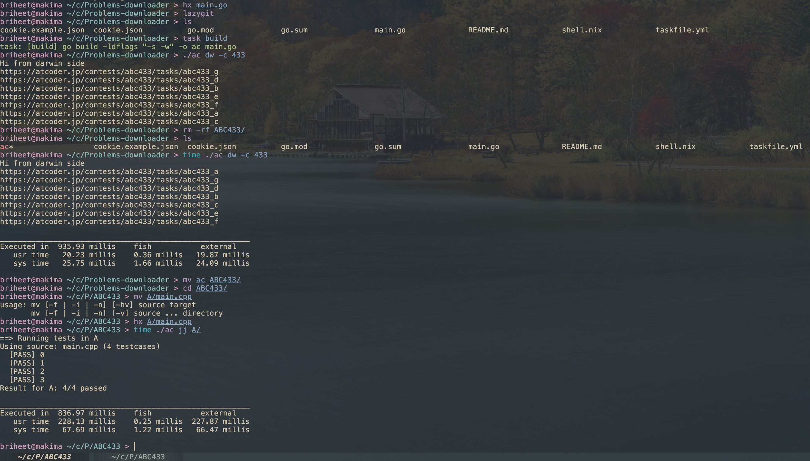

# Welcome to Ac downloader

Hi! i am Briheet. This cli tools is on purpose to be in a single file paired with a json file.
I enjoy competitive programming in my free time and use Helix as my text editor.
Its usually very weird to just use vscode and do competitive programming when Helix is my primary editor.

Hence this cli tool. It helps me to download problems for a specific context, create a new directory, and have my test cases init there.
Altough its nowwhere close, i am hoping to finish it up in my free time i get after work (sundays only :sob) so i can enjoy solving problems again :)

## Requirements

You just need golang installed on our system. This is dev phase rn.

Have a atcoder account. Go to any contest landing page, go to network tab, you will have something as abc(contest id here).
Do right click, COPY AS CURL, and paste it somewhere. Now copy the cookies values in cookie.json file. That should be it.

## Build

1. Copy the cookie file.
```bash
cp cookie.example.json cookie.json
```
Now populate the cookie file

2. First compile the project. 
```bash
go build -ldflags "-s -w" -o ac main.go
./ac -h
```

## Run

1. To Download contest, give it the contest number
```bash
./ac dw -c 430
```

## Test runner (jj)

Run sample tests for your solutions without leaving the contest folder.

- `./ac jj` or `./ac jj .` scans the current directory; if no inputs are present it auto-runs all subdirectories that have them (e.g. ABC430/A, B, etc.).
- Provide one or more dirs/paths to target specific problems: `./ac jj A`, `./ac jj A C`, or `./ac jj path/to/A`.
- Each target dir looks for `main.cpp` (or any `*.cpp`), builds with `g++ -std=gnu++17 -O2`, then runs `input*.txt` vs matching `output*.txt` with a 5s per-test timeout.
- Results show `[PASS]/[FAIL]` with compile/runtime/output mismatches surfaced while continuing across all dirs.

Usage example (from contest dir):
```bash
./ac jj
```


